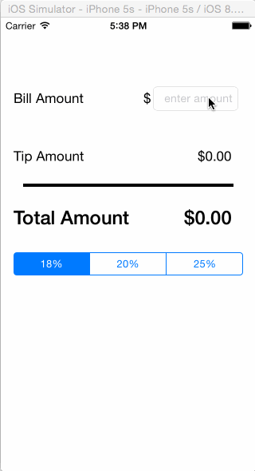

Tip Calculator
====
## Overview
A Tip Calculator utility app which allows a user to calculate the appropriate tip based on the total amount entered.

Time Spent: 2.0 hours

## User Stories

### Mandatory
1. [X] User is displayed the tip of specified percentage for specified entered amount
2. [X] User enters the total amount of the transaction
3. [X] User can select between tip amounts (i.e 18%, 20%, 25%)
4. [X] Upon selecting tip amount, formatted tip value is displayed
5. [X] User changes the total amount and updated tip is reflected automatically

### Optional
1. [X] App uses Auto Layout so it works in portrait on iPhone 4/4S/5/5S/6 and 6 Plus

## Walkthroughs

GIFs created by LiceCap <http://www.cockos.com/licecap/>
